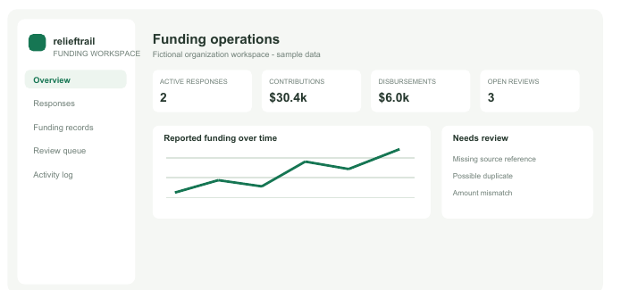

# ReliefTrail ResponseHub

ReliefTrail ResponseHub is an end-to-end portfolio demo for a fictional nonprofit response and finance team. It connects emergency response records with restricted awards, budget lines, reported disbursements, donor reporting deadlines, review tasks, and an activity history.

This is a separate follow-on project to [ReliefTrail's earlier contract prototype](https://github.com/tanay-gaykwad/relieftrail-blockchain). The earlier repository explores smart-contract event ideas; this application explores the database and workflow around those events. The contract is not currently connected, and the app does not accept donations, move money, or prove aid delivery.

> **Demo safety:** All seeded people, organizations, response records, references, and amounts are fictional. Use only the sample credentials and do not enter real donor, beneficiary, bank, or payment information. This learning project is not production-certified and must not be used for operational humanitarian data.

## What you can do

- View response and funding summaries, restricted awards, budget allocations, reporting deadlines, review flags, and recent activity.
- Create and update response records. Editors can remove an empty draft; responses with funding or review history are protected.
- Create an award for an approved response, record its donor restrictions and budget line, and track spending against that line.
- Submit a report against a donor deadline; reviewers can accept it or return it for changes.
- Let administrators update the roles of existing team accounts. Demo accounts demonstrate admin, editor, reviewer, and viewer access.
- Import a CSV after full-file validation; accepted rows are committed together, duplicates are skipped, and the file is processed in memory only.
- Search and export the fictional funding records.
- Resolve a reconciliation flag and see who performed the action in the activity history.

The API uses Argon2id password hashes, server-side revocable sessions in HttpOnly cookies, CSRF checks for write requests, login throttling, exact CORS origins, and security headers. Sessions expire after eight hours. Each request re-reads active account and organization membership from the database. Users have one of four roles: `org_admin`, `editor`, `reviewer`, or `viewer`. Response and award edits require an editor or administrator; only admins can approve or close a response; report review and reconciliation resolution require a reviewer or administrator. PostgreSQL triggers keep audit events append-only and reject award-budget overspend.

This remains an educational demo, not a product cleared for real NGO use. It does not include MFA, invited-account onboarding or password recovery, a formal security review, tested backups, a managed identity provider, or deployment hardening. Do not store real donor, beneficiary, bank, or payment information.

## Product approach

The workflow is informed by public feature descriptions for established grant platforms: applications, reviews and approvals, budgets, payments, compliance, and reporting. ResponseHub adapts a small internal subset for a fictional relief organization instead of copying another product's code or visual assets. See [Salesforce Nonprofit Cloud for Grantmaking](https://help.salesforce.com/s/articleView?id=sfdo.NPC_Nonprofit_Cloud_for_Grantmaking.htm&language=en_US&type=5) and [Fluxx Grantmaker](https://www.fluxx.io/products/grantmaker-fluxx-grants-management-software).

Security choices use OWASP guidance for adaptive password hashing, session handling, and deny-by-default access checks: [Password Storage](https://cheatsheetseries.owasp.org/cheatsheets/Password_Storage_Cheat_Sheet.html), [Session Management](https://cheatsheetseries.owasp.org/cheatsheets/Session_Management_Cheat_Sheet.html), and [Authorization](https://cheatsheetseries.owasp.org/cheatsheets/Authorization_Cheat_Sheet.html). Details and remaining gaps are in [`SECURITY.md`](SECURITY.md).

## Interface preview



This repository currently includes an illustrative interface preview, not a screenshot captured from a live database-backed deployment. See [screenshots/README.md](screenshots/README.md) for that distinction and the steps to replace it with verified captures.

## Demo walkthrough

Sign in as the demo administrator, review a response, inspect its award and allocations, and record a sample disbursement. Then open the reporting calendar to submit a short summary and sign in as the reviewer to accept it. Finally, try a write action as the viewer; the API should deny it. All examples use fictional records and local test data.

## Project status

The repository contains a working portfolio application and a local Compose setup. Backend unit/security tests and optional PostgreSQL integration tests are included; GitHub Actions runs backend tests and lint checks, plus frontend format checks and a production build. A public, deployed service has not been configured or verified. The project is production-minded portfolio work, not certified or ready for real humanitarian operations.

## What this project demonstrates

- Translating a multi-step grants workflow into relational tables, database constraints, and API behavior.
- Applying organization scoping and server-side role checks to a frontend/backend application.
- Handling imports atomically and preserving an auditable record of supported changes.
- Documenting design trade-offs and being precise about what a financial record or hash can prove.

## What I learned

Permissions need to be checked at the API boundary on every operation. Budgets and audit history need database guardrails as well as frontend hints. A polished interface can make a workflow clearer, but it cannot prove that external evidence is true or that aid reached someone.

## Why this matters

Relief organizations need to connect restricted funding to approved work, authorized spending, and funder reporting. This project models that administrative flow so it can be reviewed consistently; it does not replace financial controls, evidence verification, or field operations.

## Run locally

Requirements: Docker Desktop with Compose, Node.js 20+, and pnpm.

1. (Optional) Copy `.env.example` to `.env` to change local demo settings. Never commit `.env`.
2. Start PostgreSQL, the API, and the frontend container from this folder:

   ```powershell
   docker compose up --build
   ```

3. Open `http://localhost:5173` and sign in using one of the fictional accounts below. The API runs at `http://localhost:8000` and API docs are available at `http://localhost:8000/docs` in demo mode. To run Vite directly instead of in Docker, stop the frontend service and use:

   ```powershell
   cd frontend
   pnpm install --frozen-lockfile
   pnpm dev
   ```

   This starts the dev frontend at `http://localhost:5173`.

| Role | Email | Password |
| --- | --- | --- |
| Organization admin | `admin@relieftrail.test` | `demo-change-me` |
| Editor | `editor@relieftrail.test` | `editor-demo` |
| Reviewer | `reviewer@relieftrail.test` | `reviewer-demo` |
| Viewer | `viewer@relieftrail.test` | `viewer-demo` |

PostgreSQL runs in a named Docker volume and binds to loopback only. SQL files under `database/` are applied on the first database start. If you change the initial schema and want to rebuild this disposable demo from scratch, run `docker compose down -v` (this removes the local database contents), then `docker compose up --build`.

## Database design

The schema is in [`database/schema.sql`](database/schema.sql), sample data in [`database/seed.sql`](database/seed.sql), and query examples in [`database/queries.sql`](database/queries.sql). The design separates organizations, users, revocable sessions, memberships, responses, funders, awards, award allocations, reporting milestones, sources, import batches, funding records, reconciliation issues, and audit events. Composite foreign keys keep allocations within one organization; transactions and triggers prevent award allocations and disbursements from exceeding their approved limits. `response_funding_summary` derives totals from funding rows rather than storing duplicated totals. The ER diagram and normalization notes are in [`docs/DATA_MODEL.md`](docs/DATA_MODEL.md).

## Project files

```text
frontend/          React + TypeScript dashboard
backend/           FastAPI API, login, role checks, CSV workflow
database/          PostgreSQL schema, seed data, SQL examples
docs/              Product scope, architecture, data model, setup guide
backend/tests/     Auth, authorization, CSV, and PostgreSQL integrity checks
.github/workflows/ CI checks for backend and frontend
portfolio-site/    Static one-page portfolio; GitHub Pages workflow included
output/pdf/        Project report for coursework submission
LICENSE            MIT License, matching the companion prototype
SECURITY.md        Security design, limitations, and reporting guidance
```

## Portfolio links and artifacts

- Companion project: [ReliefTrail contract prototype](https://github.com/tanay-gaykwad/relieftrail-blockchain)
- Project brief: [`docs/PROJECT_BRIEF.md`](docs/PROJECT_BRIEF.md)
- Product scope and role matrix: [`docs/PRODUCT_SCOPE.md`](docs/PRODUCT_SCOPE.md)
- Local setup: [`docs/LOCAL_SETUP.md`](docs/LOCAL_SETUP.md)
- Security notes: [`SECURITY.md`](SECURITY.md)
- Architecture: [`docs/ARCHITECTURE.md`](docs/ARCHITECTURE.md)
- Product scope and demo flow: [`docs/PRODUCT_SCOPE.md`](docs/PRODUCT_SCOPE.md)
- Course report: [`output/pdf/relieftrail-funding-workspace-report.pdf`](output/pdf/relieftrail-funding-workspace-report.pdf)
- Interface preview: [`screenshots/dashboard-interface-preview.png`](screenshots/dashboard-interface-preview.png) (illustrative; capture a live database-backed screen after local startup)
- Portfolio landing page source: [`portfolio-site/`](portfolio-site/)

## Roadmap

1. Replace the illustrative dashboard preview with captures from the verified local app and add a short demo recording.
2. Add invited-account onboarding, account recovery, MFA, and an independent authorization review.
3. Add multi-period reporting, configurable budget categories, and a complete award close-out workflow.
4. Evaluate evidence storage only after a privacy and threat review.
5. Consider AI only for source-linked spreadsheet mapping or report drafts, with human review and clear provenance.
6. Interview grants and finance staff before product or sales claims; complete legal, privacy, operational, and security reviews before any real pilot.
