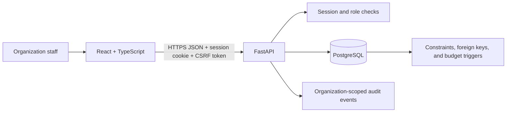

# ResponseHub architecture

## System shape

The frontend is a workflow interface; PostgreSQL remains the source of truth. The API validates requests, checks the signed-in user and organization role, and performs related changes in database transactions. There is no direct browser-to-database connection.

## Main components

- **React + TypeScript:** portfolio dashboard, response records, award budgets, reports, review queue, and activity views. Browser requests include credentials and a CSRF header. Session secrets are not stored in web storage.
- **FastAPI:** request validation, authentication, CSV parsing, tenant scoping, role-based authorization, and transaction orchestration.
- **PostgreSQL:** normalized organizations, users, memberships, sessions, responses, funders, awards, allocations, milestones, funding records, issues, imports, and audit events.
- **Docker Compose:** starts PostgreSQL and the API for a disposable local environment. Vite runs separately for development.

## Typical funding workflow

1. An organization administrator signs in. The API verifies a password hash and issues an opaque, revocable session cookie.
2. An editor creates a response as a draft. An administrator moves it into an approved state.
3. An editor records a funder, award ceiling, response budget line, restriction, period, and first reporting deadline.
4. The editor records a disbursement against a chosen allocation. The API validates amount, date, role, tenant, response and award status. A PostgreSQL trigger rechecks the remaining allocation inside the transaction.
5. An editor submits a report summary. A reviewer or administrator accepts it or returns it for revision.
6. Each supported operation writes an organization-scoped audit event in the same transaction as the change.

CSV import validates the full file before writing. Accepted rows are inserted with deduplication in a single transaction; invalid files do not partially import.

## Security boundaries and design choices

- **Server-side authorization:** the UI hides controls for convenience, but every API handler checks the organization membership and role. Composite foreign keys prevent cross-organization award/allocation links.
- **Cookie sessions:** opaque session identifiers can be revoked in the database. `HttpOnly` protects the session from ordinary JavaScript reads; CSRF checks protect state-changing requests. Production still requires TLS and correctly configured origins/secrets.
- **Relational integrity:** currency and amount rules are represented in SQL constraints. Financial totals are derived from funding rows through a view rather than duplicated in a mutable summary column.
- **Database transactions:** award creation includes the award, allocation, milestone, and audit event together. A failed step rolls back the whole change.
- **Audit trail:** application actions append events. A trigger blocks normal update/delete operations; database owners can still alter the database, so this is not tamper-proof evidence.
- **Trade-off:** the demo uses one currency (USD), simple organization roles, and a single award allocation at creation. It avoids unsupported accounting features such as foreign exchange, invoice approval, reconciliation to bank statements, or multi-signature payment authorization.

## Demo and production boundary

The Compose credentials, seeded users, fake records, and local database are for demonstration only. The application has no MFA, invitation/recovery workflow, managed identity provider, tested backups, formal threat review, or production operations runbook. Do not use it for real beneficiary, donor, bank, or payment data. See [`../SECURITY.md`](../SECURITY.md) for required production work.

## Useful entry points

- API and workflow code: [`../backend/main.py`](../backend/main.py)
- Database schema and sample data: [`../database/schema.sql`](../database/schema.sql), [`../database/seed.sql`](../database/seed.sql)
- Frontend: [`../frontend/src/App.tsx`](../frontend/src/App.tsx)
- Local startup: [`LOCAL_SETUP.md`](LOCAL_SETUP.md)
