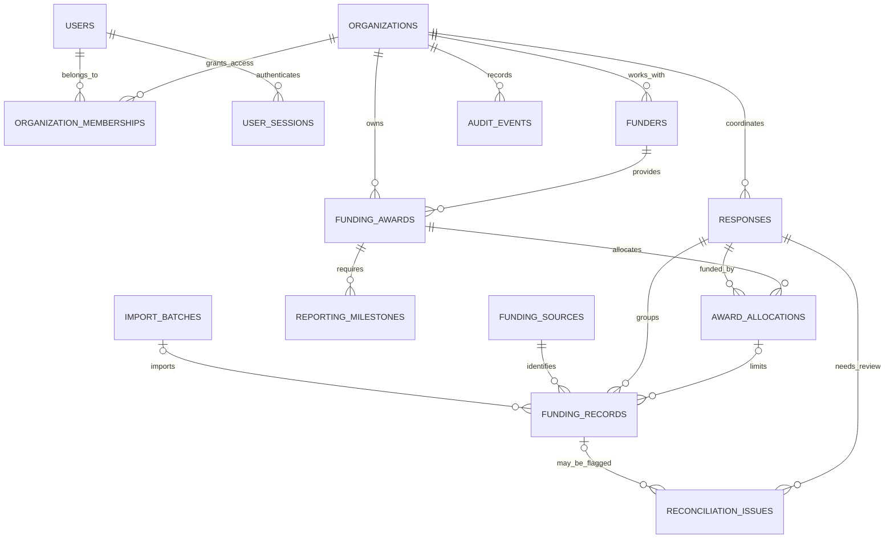

# Data model

## Tables

- **organizations** and **organization_memberships** define tenant ownership and each user's role within it.
- **users**, **user_sessions**, and **login_throttles** hold authentication identities, one-way session verifiers/revocation state, and throttling state. Raw session tokens and raw email/IP throttle keys are not stored.
- **responses** contain an organization's response code, title, location, summary, lifecycle status, and start date.
- **funders** and **funding_awards** normalize donor identity and award terms, including award ceiling, dates, and restricted purpose.
- **award_allocations** associate part of an award with a response and budget category. Composite foreign keys require award and response to belong to the same organization.
- **reporting_milestones** represent due dates and submitted/accepted/returned reporting summaries.
- **funding_sources**, **import_batches**, and **funding_records** identify the source of reported contributions or spending. Spending can reference a budget allocation; a foreign key ensures the record uses an allocation for that same response.
- **reconciliation_issues** flag records for review. **audit_events** records organization-scoped application actions.

The `response_funding_summary` view derives contribution and disbursement totals from the source rows instead of copying totals into response records.

## Normalization and integrity

Related facts are separated so updates do not require editing repeated copies of a name or role. Organization memberships form the user/organization many-to-many relation. Funders, awards, allocations, milestones, source definitions, and funding records each represent separate entities. This is a practical normalized design rather than a claim that every business rule is fully modeled.

Primary keys, unique constraints, checks, indexes, and foreign keys enforce valid types, positive amounts, response status, tenant scope, and duplicate source references. A transaction groups award creation and audit history. PostgreSQL triggers prevent award allocations above an award total, disbursements above a budget line, and ordinary edits/deletes of audit entries.

## Access boundaries

The API validates a revocable opaque session cookie, reloads active-user state and memberships, and scopes reads to those memberships. Each write checks the requested organization's role. A missing membership returns not found to avoid revealing other tenants. The frontend's hidden buttons are only a usability feature; API checks are authoritative.

## Limits

An append-only trigger does not protect against a database owner who can disable or replace triggers. There is no external immutable log sink, formal migration runner, financial accounting reconciliation, multi-currency support, MFA, or account recovery. See [`../SECURITY.md`](../SECURITY.md) for the trust boundary and production requirements.
