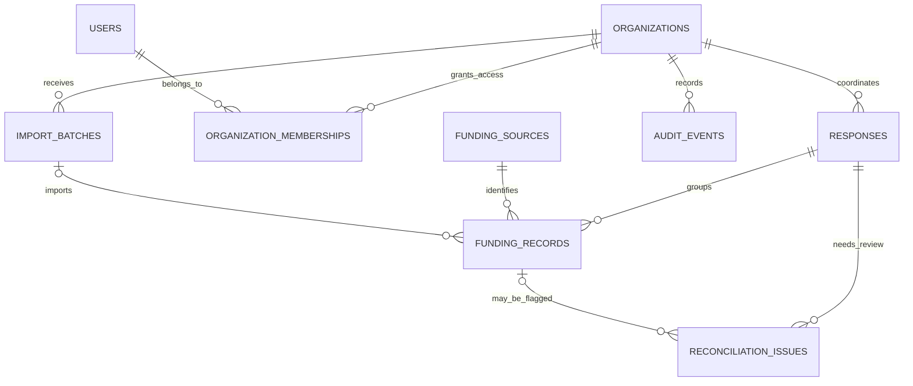

# Data model

## Tables and relationships

- **organizations** — organization identity and category.
- **users** — login identity, password hash, and active flag.
- **organization_memberships** — joins users to organizations and stores their role (`org_admin`, `editor`, `reviewer`, `viewer`). The composite primary key prevents duplicate membership.
- **responses** — an organization-owned response record with a unique code, status, dates, and summary.
- **funding_sources** — labels the source system or method (manual, CSV, chain, payment report).
- **import_batches** — organization-owned import summary. Uploaded source files are not saved.
- **funding_records** — reported contribution or disbursement, linked to a response and source. Repeated source references in the same response/source pair are rejected.
- **reconciliation_issues** — a review flag on a response and, optionally, one funding record.
- **audit_events** — organization-scoped action history. A PostgreSQL trigger rejects update and delete operations.

The `response_funding_summary` view joins responses, organizations, and funding rows to calculate contribution and disbursement totals. Totals are derived instead of copied into the response row.

## Normalization and integrity

The schema separates facts into related tables, then links them through primary and foreign keys. For example, a response stores an organization ID instead of repeating its organization name in every response; a funding entry stores a source ID and response ID rather than duplicating their details. This reduces update anomalies and demonstrates a practical 3NF-style design. It also uses checks for allowed statuses, roles, types, currency, amount, and text/code formats. Indexes support organization membership, response status, date, review state, and audit lookups.

## Access boundaries

The API validates an eight-hour signed bearer token, loads a user's organization memberships, and filters reads to those organizations. Writes check membership role for the specific organization. A missing membership returns not found, so API responses do not reveal whether another organization exists. Demo startup creates fictional admin, editor, reviewer, and viewer accounts in organization 1.

## Limitations

The activity log is append-only in the demo database, but there is no external log sink, tamper-evident chain, privileged database separation, or production operations monitoring. Password reset, invitation workflows, MFA, login throttling, and migration tooling are not implemented. The demo uses local-only secret defaults and must not be internet-deployed as-is.

